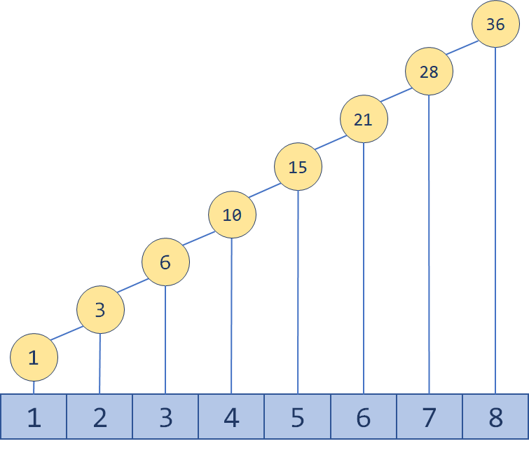
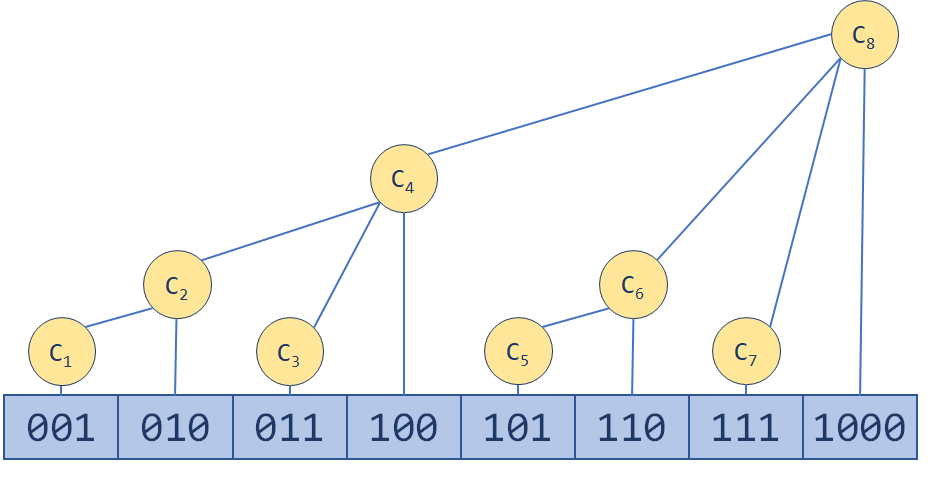

## 树状数组
### 简述

最简单的树状数组支持两种操作，时间复杂度均为$\mathcal{O(logn)}$。
- 单点修改：更改一个位置的值
- 区间查询：查询区间$\mathcal{[i,j]}$的和，或者其他操作
  
对于普通的一维数组而言，单点修改的时间复杂度为$\mathcal{O(1)}$,而区间求和的复杂度为$\mathcal{O(n)}$，而是用前缀和计算，则单点修改为$\mathcal{O(n)}$，区间求和为$\mathcal{O(1)}$。整体复杂度始终为$\mathcal{O(n)}$，因此找到一种折中方法，使得无论是单点修改还是区间查询均为$\mathcal{O(logn)}$。



而树状数组的形式则是将前n项和离散的分为多个前缀，比如[1,6]就可以分为[1,4],[5,6],区间求和时$\mathcal{sum[1,6]=sum[1,4]+sum[5,6]}$;而对于不是从1开始的区间求和，比如[5,7]则$\mathcal{sum[5,7]=sum[1,7]-sum[1,4]}$;

而对于树状数组而言，区间离散划分则是由lowbit(i)计算，区间[1,i]划分为$\mathcal{[1,i-lowbit(i)],[i-lowbit(i)+1,i]}$;

    从[1,1]到[1,8]划分如下:
        [1,1]=[1,1]                           (1=1)
        [1,2]=[1,2]                           (2=2)
        [1,3]=[1,2]+[3,3]                     (3=2+1)
        [1,4]=[1,4]                           (4=4)
        [1,5]=[1,4]+[5,5]                     (5=4+1)
        [1,6]=[1,4]+[5,6]                     (6=4+2)
        [1,7]=[1,4]+[5,6]+[7,7]               (7=4+2+1)
        [1,8]=[1,8]                           (8=8)

如何划分,由二进制便可轻易理解
- $6=(0110)_2$因此[1,6]区间划分大小为2,4,即$[1,4],[5,6]$
- $7=(0111)_2$因此[1,7]区间划分为$[1,4],[5,6],[7,7]$
- $11=(1011)_2$因此[1,11]区间划分为$[1,8],[9,10],[11,11]$
### lowbit(i)
$\mathbb{}{lowbit(i)}$计算方式如下:    
$$\mathcal{lowbit(i)=(i)\And(-i)}$$
### 属性
```c++
class TreeArray{
    vector<int> nums;//保存数据
    vector<int> tree;//保存对应区间和
}
```

### 更新数据
更新数据时,只会更新包含该数据的区间,比如
size=8的数组,修改第5位则只会影响$[5,5],[5,6],[1,8]$,修改时下一区间为$i+lowbit(i)$

代码如下
```c++
    void UpDate(int index,int val)
    {
        int sub = val - nums[index];
        nums[index]=val;
        for(int i=index+1;i<tree.size();i+=lowbit(i))
        {
            tree[i]+=sub;
        }
    }
```
### 区间查询
```c++
    int one2index(int index)
    {
        int sum=0;

        for(;index>0;index-=lowbit(index))
        {
            sum+=tree[index];
        }
        return sum;
    }


    int FindRange(int left,int right)
    {
        return one2index(right+1)-one2index(left);
    }
```
### 完整代码
```c++
class TreeArray {
	vector<int> nums;//保存数据
	vector<int> tree;//保存对应区间和
	int lowbit(int index)
	{
		return index & -index;
	}
	int one2index(int index)
	{
		int sum = 0;

		for (; index > 0; index -= lowbit(index))
		{
			sum += tree[index];
		}
		return sum;
	}


	int FindRange(int left, int right)
	{
		return one2index(right + 1) - one2index(left);
	}
	void UpDate(int index, int val)
	{
		int sub = val - nums[index];
		nums[index] = val;
		for (int i = index + 1; i < tree.size(); i += lowbit(i))
		{
			tree[i] += sub;
		}
	}

public:
	TreeArray(vector<int>nums)
	{
		int size = nums.size();
		this->nums = vector<int>(size);
		tree = vector<int>(size+1);

		for (int i = 0; i < size; i++)
		{
			UpDate(i, nums[i]);
		}
	}
};
```